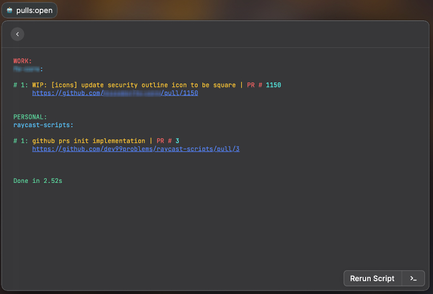

<div align="center">
    
    <h1>raycast-scripts</h1>
</div>

Home of **dev99problems'** `Raycast` daily routine scripts

## Raycast
[raycastapp](https://www.raycast.com/) is a kind of tool, that can be described as `Spotlight` on steroids. 
It is **simple**, **flexible**, does not require any **~~paid subscription~~** at the moment, and provides a great functionality
of interacting with a lot of apps on your MacOS, not opening directly.

Another **killer feature** — the ability to run scripts at `the fingertips `.
So `this repo` is a home for my personal `scripts`, which I use pretty often. Nothing major, no rocket science,
just the small simple things, which `make my life easier`.

## List of commands
### 💴 kuna:doge


Gets the latest **DOGE/UAH** information from [kuna.io](https://kuna.io/markets/dogeuah)


### 🤖 pulls:open


Gets all open `Github pull-requests` of author, from a `list of projects`, grouped by the `section`.



#### Motivation
Even though, `Raycast` has this functionality `out of the box`, if you use your `personal` Github account for both **personal**
projects and **private** projects of your work `organization`, you often need to request the broader list of `access` in your 
organization for this integration to be able to get your `work pull-requests` and it may be a problem.

**`So to avoid that`** restrictions and additional access requests, this little fellow was implemented.

#### Configuration
This command uses external config file `env.js` file of the next shape
```js
// github-prs/env.js
module.exports = {
    authToken: 'auth_token_goes_here', // your GH auth token
    creator: 'dev99prblems', // your GH user name aka author
    projects: {
        work: {
            owner: 'apple', // your organization name goes here
            repos: [
                'project1',
                'project2'
            ]
        },
        personal: {
            owner: 'dev99problems',
            repos: [
                'raycast-scripts',
                'alfred-translayta'
            ]
        }
    }
}
```


## Related Links 
Here is `repo` of [community driven scripts](https://github.com/raycast/script-commands) for `Raycast`
