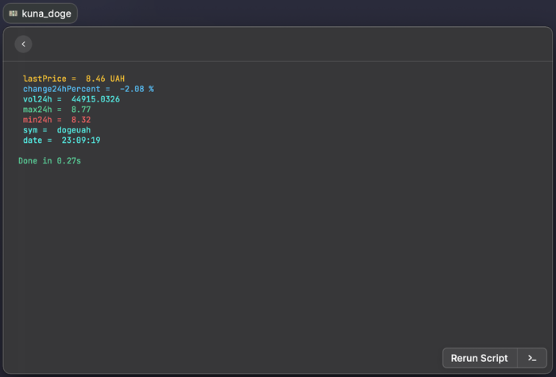

# raycast-scripts
Home of dev99problems' raycastapp scripts

## Raycast
[raycastapp](https://www.raycast.com/) is a kind of tool, that can be described as `Spotlight` on steroids. 
It is **simple**, **flexible**, does not require any ~~paid subscription~~ at the moment, and provides a great functionality
of interacting with a lot of apps on your MacOS, not opening them at all.

Another killer feature — the ability to run scripts on `at the tips of fingers`.
So `this repo` is a home for my personal `scripts`, which I use pretty often. Nothing major, no rocket science,
just the small simple things, which make my life easier.

## List of scripts
💴 kuna_doge
Gets the latest DOGE/UAH information from [kuna.io](https://kuna.io/markets/dogeuah), where
```
lastPrice — last price
change24Percent — change of price in 24 hours
vol24h — volume of trade by ticker in 24h 
max24h — maximum price in 24h
min24h — minimum price in 24h
sym — ticker of DOGE/UAH pair
date — datetime of request, currently in HH:MM:HH format
```

